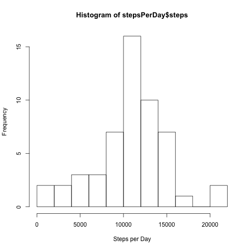
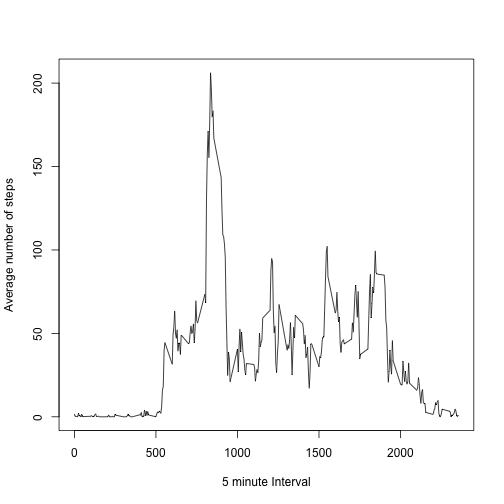
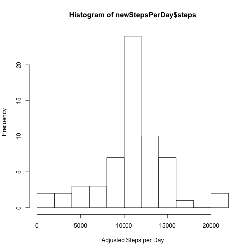
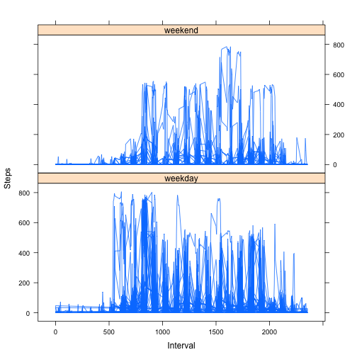

Reproducible Research
=====================

## Loading and Prepocesiing data


```r
activity<-read.csv("activity.csv")
```

```
## Warning in file(file, "rt"): cannot open file 'activity.csv': No such file
## or directory
```

```
## Error in file(file, "rt"): cannot open the connection
```

```r
noNA<-na.omit(activity)
```

# What is the total number of steps taken per day?


```r
stepsPerDay<- aggregate(steps~date, noNA, sum)
hist(stepsPerDay$steps, breaks=10, xlab="Steps per Day")
```

 

```r
rmean<-mean(stepsPerDay$steps)
rmedian<-median(stepsPerDay$steps)
```

The mean is 1.0766189 &times; 10<sup>4</sup> and median is 10765

## What is the average daily activity pattern?


```r
stepsByInterval<- aggregate(steps~interval, noNA, mean)
plot(stepsByInterval$interval, stepsByInterval$steps, type="l", xlab="5 minute Interval", ylab="Average number of steps")
```

 

```r
maxInterval<- stepsByInterval[which.max(stepsByInterval$steps),1]
```

The 5-minute interval with the maximum average steps is 835

## Imputing missing values


```r
missingValues<- sum(!complete.cases(activity))
```

The number or missing values in the dataset is 2304

Now, filling in missing values with the mean 5-minute interval values

```r
newData<- activity
for(i in 1:nrow(newData)){
if(is.na(newData$steps[i])){
  newData$steps[i]<-stepsByInterval[which(stepsByInterval$interval==newData$interval[i]),]$steps
}}
```

Recounting total steps per day and creating histogram


```r
newStepsPerDay<- aggregate(steps~date, newData, sum)
hist(newStepsPerDay$steps, breaks=10, xlab="Adjusted Steps per Day")
```

 

```r
newMean<- mean(newStepsPerDay$steps)
newMedian<-median(newStepsPerDay$steps)
meanDiff<- rmean-newMean
medianDiff<- rmedian-newMedian
```

the imputed data mean is 1.0766189 &times; 10<sup>4</sup>
the imputed data median is 1.0766189 &times; 10<sup>4</sup>

the difference in mean values is 0
the difference in median values is -1.1886792

## Are there differences in activity patterns between weekdays and weekends?


```r
newData$date<- as.Date(newData$date)
newData$dow<- as.factor(ifelse(weekdays(newData$date)%in% c("Saturday","Sunday"), "weekend", "weekday"))
library(lattice)
xyplot(newData$steps~newData$interval|newData$dow, layout=c(1,2), type="l", xlab="Interval", ylab="Steps")
```

 

